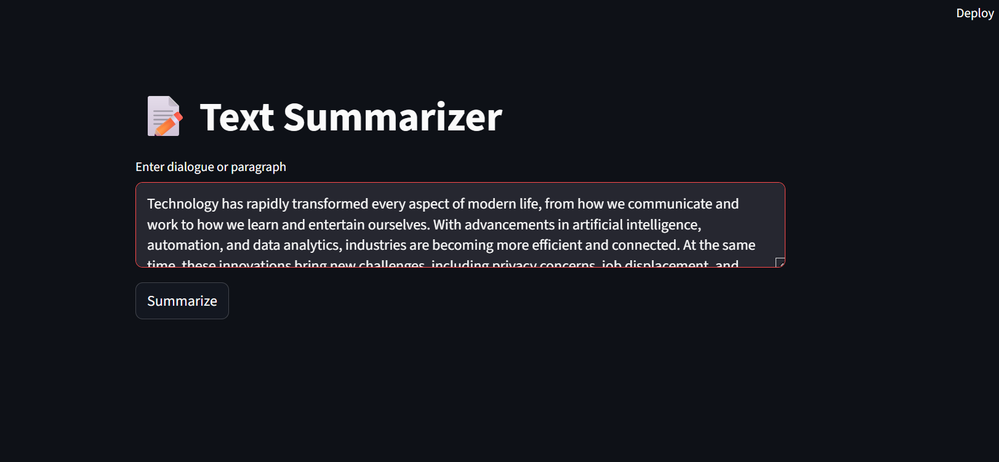
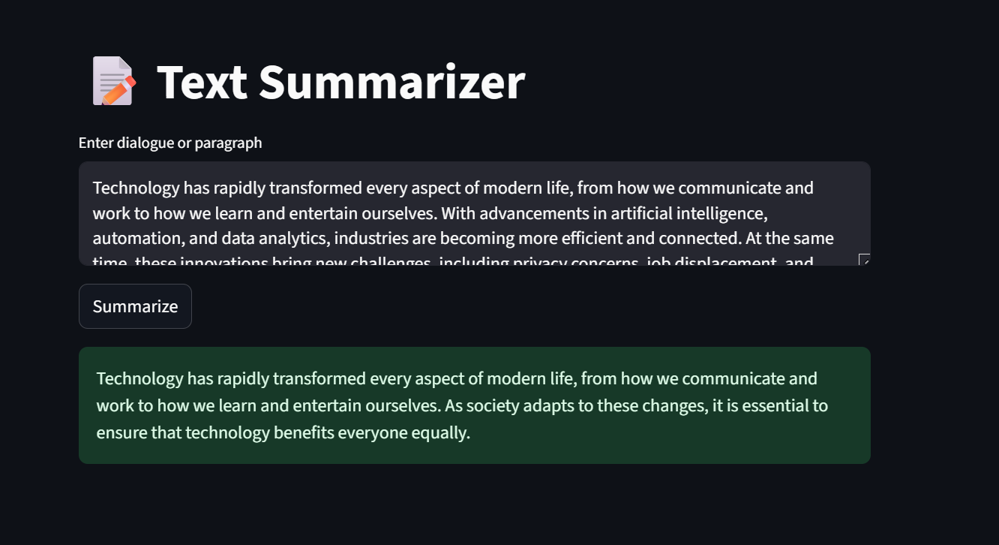

# 📝 Text Summarizer using Transformers (BART on Samsum Dataset)

This is an **end-to-end abstractive text summarization project** using the **BART-large-CNN model fine-tuned on the SAMSum dataset**. The project supports training, inference, and deployment via Streamlit on platforms like Render.

---

## 📁 Folder Structure

```
🔹 config/
│   └── config.yaml                # Configuration file (model name, batch size, etc.)
│
🔹 data/
│   ├── samsum-train.csv
│   ├── samsum-test.csv
│   └── samsum-validation.csv     # Input dataset (SAMSum)
│
│
🔹 src/
│   └── textSummarizer/
│       ├── components/
│       │   ├── data_loader.py     # Loads and processes datasets
│       │   ├── infer.py           # Summarization logic
│       │   ├── model_init.py      # Loads model & tokenizer
│       │   ├── tokenizer.py       # Tokenizer utility
│       │   └── trainer.py         # Model training code
│       │
│       ├── pipeline/
│       │   └── train_pipeline.py  # Training pipeline script
│       │
│       ├── utils/
│       │   ├── __init__.py
│       │   └── common.py          # Utility functions
│       │
│       ├── app.py                 # Streamlit UI for summarization
│       └── main.py                # Main orchestrator for CLI runs
│
🔹 requirements.txt               # Python dependencies
🔹 setup.sh                       # Streamlit setup script for deployment
🔹 README.md                      # Project documentation
```

---

## 💠 Features

- ✅ Train a transformer model on the SAMSum dataset
- ✅ Use pretrained model like `philschmid/bart-large-cnn-samsum`
- ✅ Summarize long texts in real-time via Streamlit interface
- ✅ Easily deployable to Render/Heroku
- ✅ Configurable parameters via `config.yaml`

---

## 🎞️ Installation

```bash
# Clone the repo
git clone https://github.com/your-username/text-summarizer.git
cd text-summarizer

# Create virtual environment
python -m venv venv
source venv/bin/activate

# Install dependencies
pip install -r requirements.txt
```

---

## ⚙️ Configuration

Edit the `config/config.yaml` file:

```yaml
model_name: philschmid/bart-large-cnn-samsum
sample_size: 100
batch_size: 4
epochs: 3
```

---

## 🚀 Usage

### ▶️ 1. Train the Model

```bash
python src/textSummarizer/pipeline/train_pipeline.py
```

---

### 🧪 2. Run Inference via Script

```python
from src.textSummarizer.components.model_init import load_model
from src.textSummarizer.components.infer import summarize

tokenizer, model = load_model("philschmid/bart-large-cnn-samsum")
text = "Your input text here..."
print(summarize(text, model, tokenizer))
```

---

### 🌐 3. Run Streamlit App (Locally)

```bash
streamlit run src/textSummarizer/app.py
```

Then open [http://localhost:8501](http://localhost:8501)

---

#### 🔧 `requirements.txt`

```
streamlit
torch
transformers
PyYAML
```

## 📊 Dataset

We use the [SAMSum dataset](https://huggingface.co/datasets/samsum), which contains \~16k dialogue-summary pairs ideal for conversational summarization.

---

## 🧠 Model Info

Model: [`philschmid/bart-large-cnn-samsum`](https://huggingface.co/philschmid/bart-large-cnn-samsum)\
Base: `facebook/bart-large-cnn`

---

## 🙇‍♂️ Author

- **Your Name**
- Email: [sachinguptadec03@email.com](mailto\:your@email.com)
- GitHub: [@SachinGupta2012](https://github.com/your-handle)

---

## 🖼️ Example

**Input**:

```
A: Hey! Did you watch the new episode of Stranger Things?
B: Yes! It was amazing!
```

**Summary**:

```
Two friends discuss the new episode of Stranger Things.
```

---

**ScreenShots**






